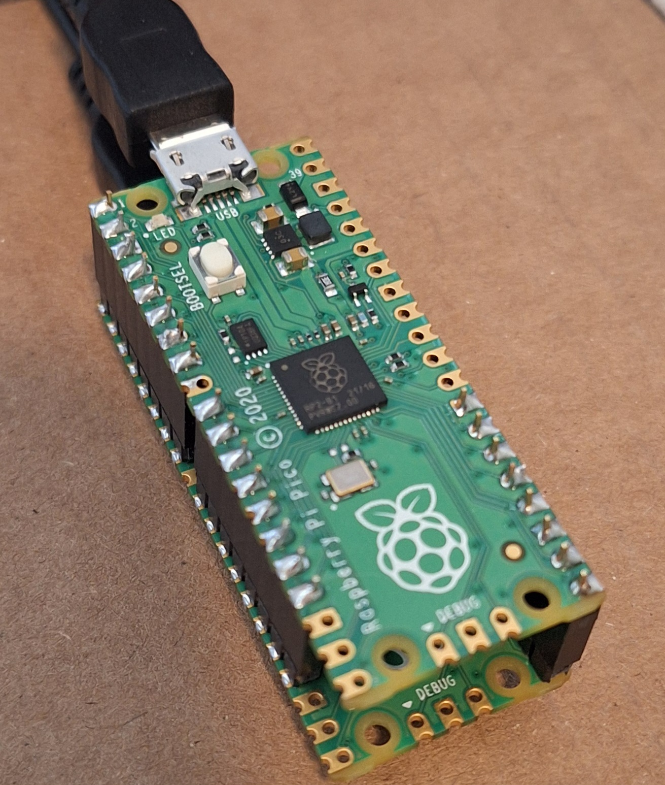
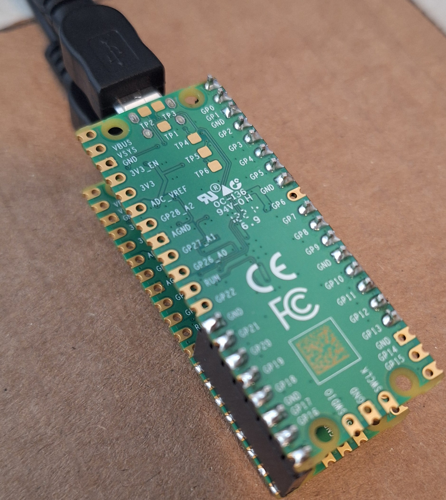
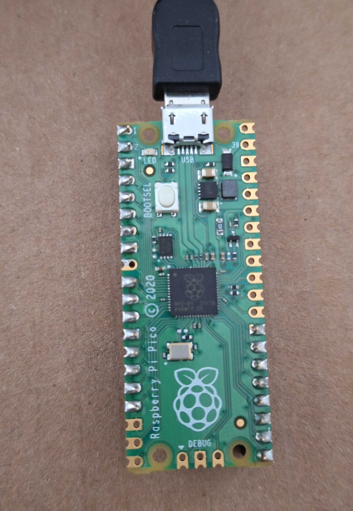
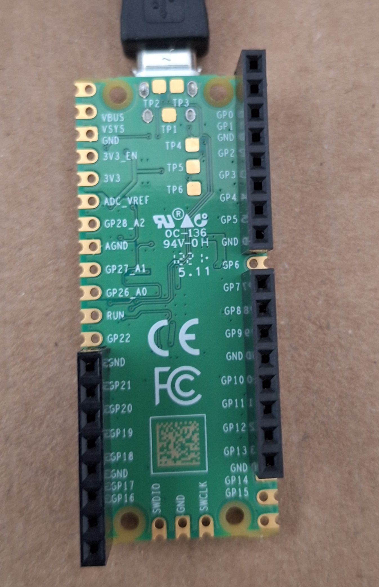
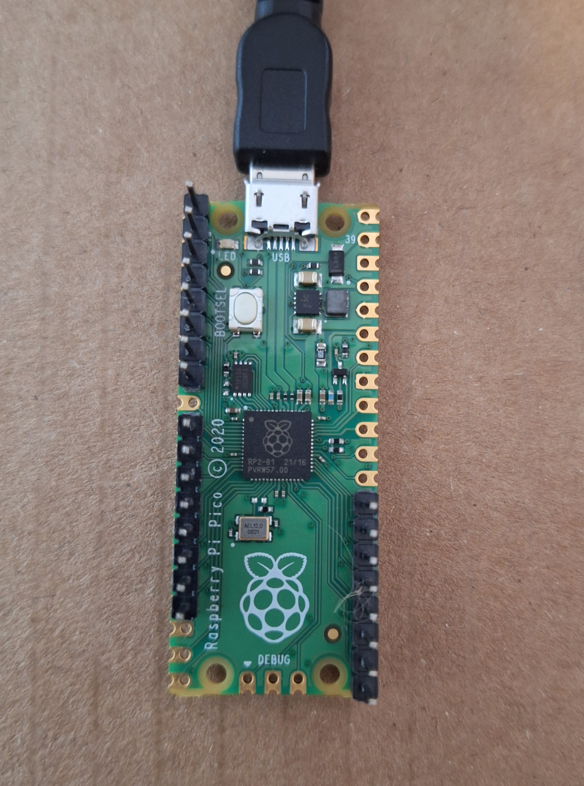
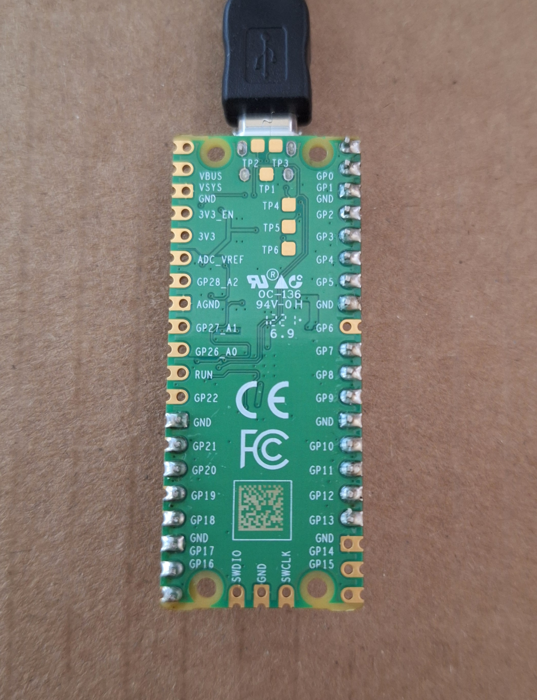

# picowriter




one pi pico takes strings from serial and transmits them using a parallel data protocol to another which types the string into a second computer

[Adafruit link to download and install Circuit Python on the Pi Pico](https://learn.adafruit.com/getting-started-with-raspberry-pi-pico-circuitpython/circuitpython)

## Receive 




```
# picowriter recieve side

import board
import digitalio
import time
import usb_hid
from adafruit_hid.keyboard import Keyboard
from adafruit_hid.keyboard_layout_us import KeyboardLayoutUS
from adafruit_hid.keycode import Keycode

keyboard = Keyboard(usb_hid.devices)
keyboard_layout = KeyboardLayoutUS(keyboard)  # We're in the US :)


messagebit = digitalio.DigitalInOut(board.GP0)
messagebit.direction = digitalio.Direction.INPUT

previousmessagebit = False

bytebit = digitalio.DigitalInOut(board.GP1)
bytebit.direction = digitalio.Direction.INPUT

previousbytebit = False

asciibit1 = digitalio.DigitalInOut(board.GP2)
asciibit1.direction = digitalio.Direction.INPUT
asciibit2 = digitalio.DigitalInOut(board.GP3)
asciibit2.direction = digitalio.Direction.INPUT
asciibit3 = digitalio.DigitalInOut(board.GP4)
asciibit3.direction = digitalio.Direction.INPUT
asciibit4 = digitalio.DigitalInOut(board.GP5)
asciibit4.direction = digitalio.Direction.INPUT
asciibit5 = digitalio.DigitalInOut(board.GP7)
asciibit5.direction = digitalio.Direction.INPUT
asciibit6 = digitalio.DigitalInOut(board.GP8)
asciibit6.direction = digitalio.Direction.INPUT
asciibit7 = digitalio.DigitalInOut(board.GP9)
asciibit7.direction = digitalio.Direction.INPUT
messagestring = ""
print("\n")

while True:
    if not previousmessagebit and messagebit.value:
        messagestring = ""
        previousmessagebit = True
    if previousmessagebit and not messagebit.value:
        previousmessagebit = False
        print(messagestring)
        keyboard_layout.write(messagestring)
    if not previousbytebit and bytebit.value:        
        previousbytebit = True
        asciibit1value = asciibit1.value
        asciibit2value = asciibit2.value
        asciibit3value = asciibit3.value
        asciibit4value = asciibit4.value
        asciibit5value = asciibit5.value
        asciibit6value = asciibit6.value
        asciibit7value = asciibit7.value
        asciivalue = asciibit1value + asciibit2value*2 + asciibit3value*4 + asciibit4value*8 + asciibit5value*16 + asciibit6value*32 + asciibit7value*64
        asciichar = chr(asciivalue) 
        messagestring = messagestring + asciichar        
    if previousbytebit and not bytebit.value:
        previousbytebit = False
    time.sleep(0.0001)
        
```

## Transmit





```
#https://stackoverflow.com/questions/48922189/receive-data-from-host-computer-using-circuit-python-on-circuit-playground-expre

import supervisor
import board
import digitalio
import time

tictime = 0.005

startpausetime = 0.01

messagebit = digitalio.DigitalInOut(board.GP0)
messagebit.direction = digitalio.Direction.OUTPUT


bytebit = digitalio.DigitalInOut(board.GP1)
bytebit.direction = digitalio.Direction.OUTPUT

asciibit1 = digitalio.DigitalInOut(board.GP2)
asciibit1.direction = digitalio.Direction.OUTPUT
asciibit2 = digitalio.DigitalInOut(board.GP3)
asciibit2.direction = digitalio.Direction.OUTPUT
asciibit3 = digitalio.DigitalInOut(board.GP4)
asciibit3.direction = digitalio.Direction.OUTPUT
asciibit4 = digitalio.DigitalInOut(board.GP5)
asciibit4.direction = digitalio.Direction.OUTPUT
asciibit5 = digitalio.DigitalInOut(board.GP7)
asciibit5.direction = digitalio.Direction.OUTPUT
asciibit6 = digitalio.DigitalInOut(board.GP8)
asciibit6.direction = digitalio.Direction.OUTPUT
asciibit7 = digitalio.DigitalInOut(board.GP9)
asciibit7.direction = digitalio.Direction.OUTPUT


while True:
    if supervisor.runtime.serial_bytes_available:
        value = input()
        asciiArray = list(value.encode('ascii'))
#        print(asciiArray)
        messagebit.value = True
        time.sleep(startpausetime)
        for asciinumber in asciiArray:
#            print(bin(asciinumber))
            if((asciinumber) & 1):
                asciibit1value = 1
                asciibit1.value = True
            else:
                asciibit1value = 0
                asciibit1.value = False
            if((asciinumber >> 1) & 1):
                asciibit2value = 1
                asciibit2.value = True
            else:
                asciibit2value = 0
                asciibit2.value = False
            if((asciinumber >> 2) & 1):
                asciibit3value = 1
                asciibit3.value = True
            else:
                asciibit3value = 0
                asciibit3.value = False
            if((asciinumber >> 3) & 1):
                asciibit4value = 1
                asciibit4.value = True
            else:
                asciibit4value = 0
                asciibit4.value = False
            if((asciinumber >> 4) & 1):
                asciibit5value = 1
                asciibit5.value = True
            else:
                asciibit5value = 0
                asciibit5.value = False
            if((asciinumber >> 5) & 1):
                asciibit6value = 1
                asciibit6.value = True
            else:
                asciibit6value = 0
                asciibit6.value = False
            if((asciinumber >> 6) & 1):
                asciibit7value = 1
                asciibit7.value = True
            else:
                asciibit7value = 0
                asciibit7.value = False
            bytebit.value = True
            time.sleep(tictime)
            bytebit.value = False
            time.sleep(tictime)
            #print(str(asciibit7value) + str(asciibit6value)  + str(asciibit5value)  + str(asciibit4value) + str(asciibit3value)  + str(asciibit2value)  + str(asciibit1value))
        # ASCII 0001010 = 8 + 2 = 10 decimal ascii value which is newline
        asciibit1.value = False
        asciibit2.value = True
        asciibit3.value = False
        asciibit4.value = True
        asciibit5.value = False
        asciibit6.value = False
        asciibit7.value = False

        bytebit.value = True
        time.sleep(tictime)
        bytebit.value = False
        time.sleep(tictime)

        messagebit.value = False
        asciibit1.value = False
        asciibit2.value = False
        asciibit3.value = False
        asciibit4.value = False
        asciibit5.value = False
        asciibit6.value = False
        asciibit7.value = False


#        print(f"Received: {asciiArray}\r") 
```
